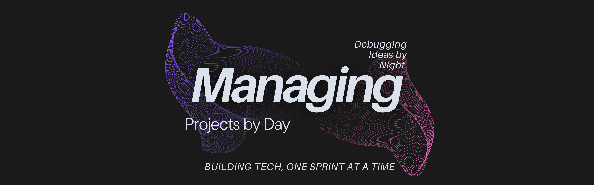

# Hey there, I'm Om Vashishtha!

A **Technical Project Manager with a passion for systems and technology**, a soft spot for clean dashboards, and a firm belief that even a to-do list can be beautiful (and strategic 😎).  
Currently working at **Amazon**, building **automation systems, AI tools, and operational platforms** that solve real problems.

---

## 🧠 About Me (a quick byte)

- 🏢 **Technical Project Manager at Amazon** — helping turn chaos into clarity, one system at a time.
- 🎓 **BCA – Computer Science**
- ⚙️ Builder of tools in **Automation, Cybersecurity, and Product Systems**
- 🤖 Exploring **AI Automation, Product Strategy, and Workflow Systems**
- 📈 Interested in designing **scalable execution systems for teams**

---

# ⚙️ Tech Stack

## Frontend

---

## Backend & Development

---

## Database

---

## Cybersecurity & APIs

---

## AI & Automation

---

## Operating Systems

---

## Developer Tools

---

## Product & Project Management

---

# 🎯 Current Focus

My work spans **product development, execution systems, and automation platforms** designed to help teams operate more effectively.

I'm particularly interested in building tools that **remove friction from everyday work** — whether through better decision visibility, automation workflows, or structured operating systems for teams.

Areas I focus on:

- AI-powered automation systems  
- Product execution frameworks  
- Cybersecurity awareness tools  
- Workflow automation platforms  
- Operational dashboards & decision systems  

---

# ⚙️ How I Work

### Clarity Before Speed
Most delivery problems are not technical. They come from unclear expectations and delayed decisions.

### Systems Over Heroics
Reliable systems outperform last-minute heroics. I design workflows and tools that make execution predictable.

### Execution Matters
Ideas are easy. Execution is what creates value.

### Automation Where It Helps
Automation should remove friction, not add complexity.

---

# 🌐 Let's Connect

📧 Mail  
mailto:omvashishtha0412@gmail.com  

💼 LinkedIn  
https://www.linkedin.com/in/omvashishtha  

🌐 Portfolio  
https://omvashishtha.in  

---

<picture>
  <source media="(prefers-color-scheme: dark)" srcset="https://raw.githubusercontent.com/tobiasmeyhoefer/tobiasmeyhoefer/output/github-snake-dark.svg" />
  <source media="(prefers-color-scheme: light)" srcset="https://raw.githubusercontent.com/tobiasmeyhoefer/tobiasmeyhoefer/output/github-snake.svg" />
</picture>

---

☕ *Fueled by green tea and chaotic good energy — this README evolves faster than my caffeine (12.12.03) tolerance.*
GitHub snake animation

If you want, I can also show you one upgrade that will make your GitHub look 10× better instantly:
a professional GitHub header banner (like Google engineers use) with your name + tagline.

