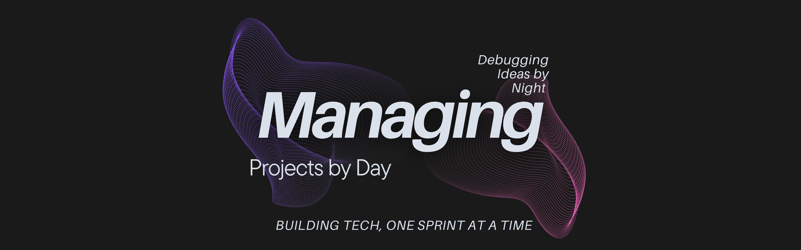

# Hey there, I'm Om Vashishtha!

A **Project Manager with a passion for tech**, a soft spot for clean dashboards, and a firm belief that even a to-do list can be beautiful (and strategic 😎). Currently working at **Amazon**, finishing my **BCA**, and building projects that solve real problems.

---

## About Me (a quick byte)
- Full-time **Project Manager at Amazon** – helping turn chaos into clarity, one project at a time.
- Final-year **BCA student** – because multitasking makes life more thrilling.
- Tech explorer – I build tools in **Project Management**, **Cybersecurity**, and **AI** that make life (and work) simpler.
- Currently diving deeper into **Product Management** & **GenAI**, because why stop at just one tech obsession?

---

## Tech Stack I Use:

### Frontend

### Backend & Logic

### Database

### APIs & Security

### Tools & Platforms

### Project & Task Management

---

## Projects I'm Proud Of

### Cybersecurity Awareness & Phishing Detection Platform  
My **BCA Final Year Project** – detects phishing links, promotes cybersecurity awareness, and helps users stay safe online.  
Tech: Flask • MySQL • APIs • JWT  
🔗 [View Project](https://github.com/omvashishtha/phishing-detection-platform)

### StakeHolder Log 
A powerful dashboard to manage tasks, timelines, stakeholders & risks — for learners and professionals alike.  
Tech: React • Flask • MySQL  
🔗 [View Project](https://github.com/omvashishtha/stakeholder-log)

### PRISM - Task Prioritization Tool  
Prioritizes your work using AI + Eisenhower Matrix. Because “ASAP” isn’t always the answer.  
Tech: Flask • OpenAI API • JavaScript  
🔗 [View Project](https://github.com/omvashishtha/prism-task-prioritization)

---

## Let's Connect

Got a collab idea or want to geek out over project tools?  
[Mail](mailto:omvashishtha.ov@gmail.com)  
[LinkedIn](https://www.linkedin.com/in/omvashishtha)  
[Check out my Portfolio](https://omvashishtha.online) (evolving 🚧)

<picture>
  <source media="(prefers-color-scheme: dark)" srcset="https://raw.githubusercontent.com/tobiasmeyhoefer/tobiasmeyhoefer/output/github-snake-dark.svg" />
  <source media="(prefers-color-scheme: light)" srcset="https://raw.githubusercontent.com/tobiasmeyhoefer/tobiasmeyhoefer/output/github-snake.svg" />
</picture>

---

*Fueled by green tea and chaotic good energy — this README evolves faster than my caffeine tolerance.*
